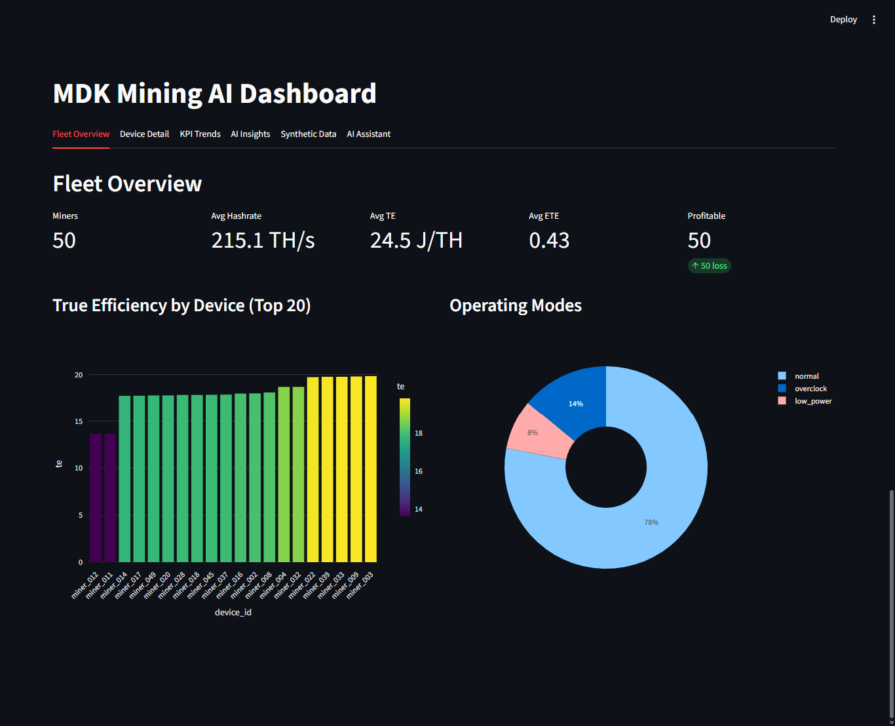
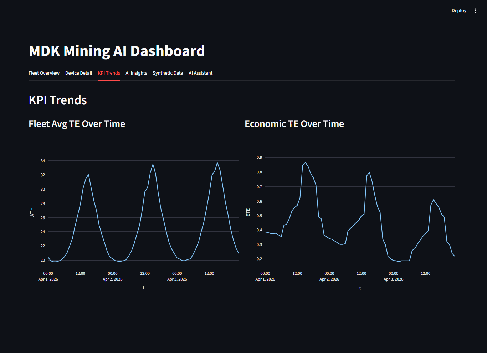
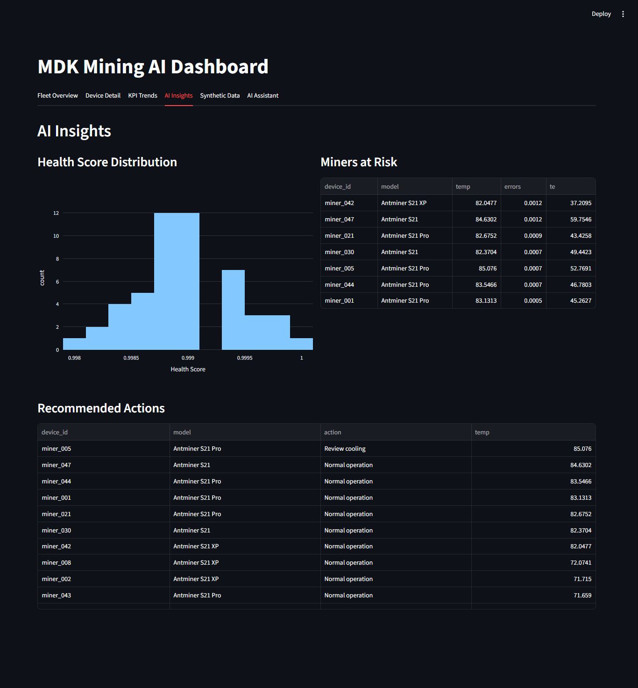
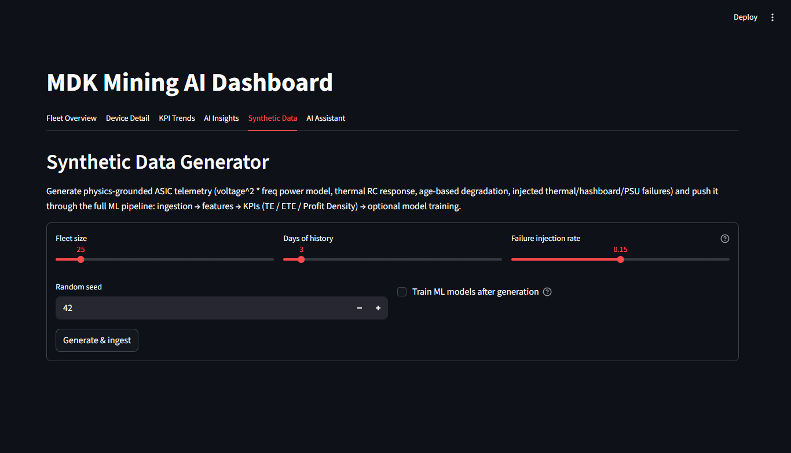
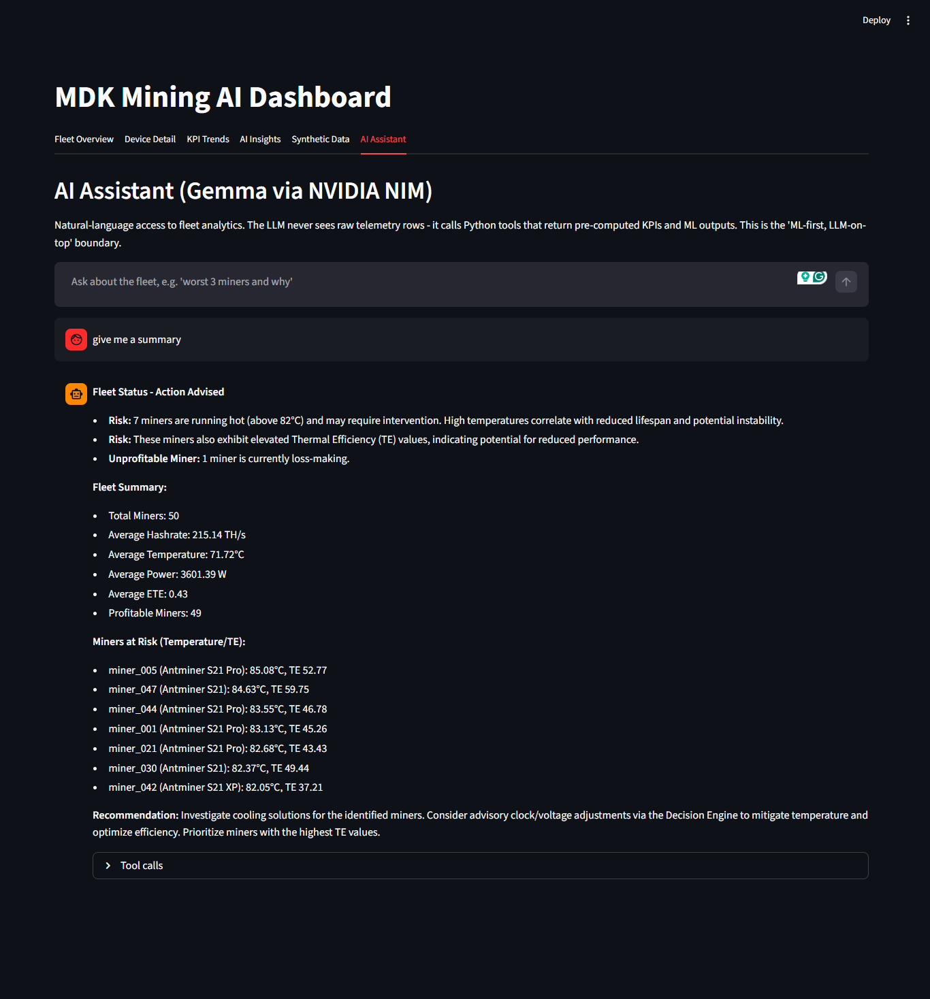
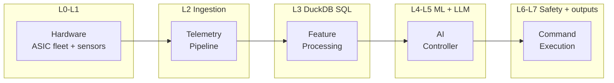
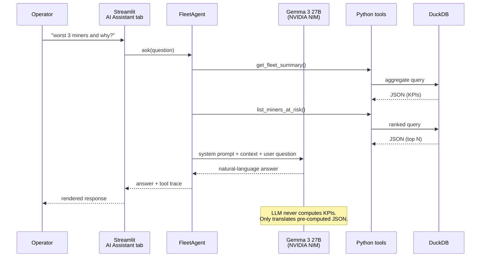
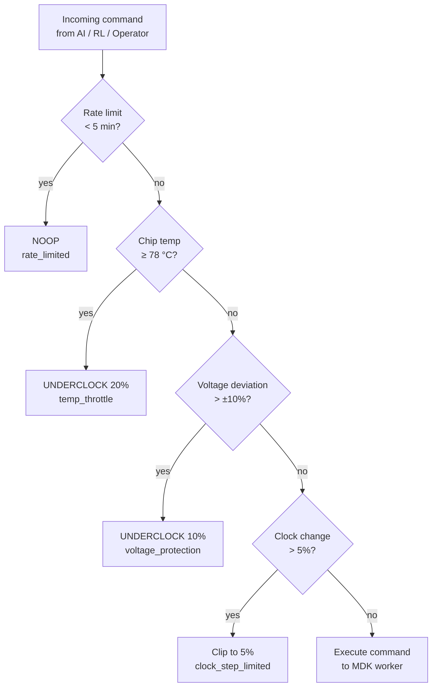

# MDK Mining AI

AI-driven optimization and predictive maintenance for Bitcoin mining fleets. Layered architecture (ML first, LLM on top) designed to sit adjacent to Tether's MDK / MOS JavaScript stack.

> Plan B Network CUBO+ 2026 -- Developer Track
> Assignment: AI-Driven Mining Optimization & Predictive Maintenance (Tether)
> Mentor: Gio Galt, Head of MOS @ Tether

### Dashboard Preview

| Fleet Overview | KPI Trends |
|---|---|
|  |  |

| AI Insights | Synthetic Data |
|---|---|
|  |  |

| AI Assistant |
|---|
|  |

---

## What it does

- **Predictive maintenance.** Isolation Forest + LSTM Autoencoder + XGBoost (multi-class) flag thermal / hashboard / PSU pre-failures 12-72 h in advance; SHAP explains each prediction.
- **Dynamic control.** PPO reinforcement-learning agent (Stable-Baselines3) proposes clock and voltage adjustments; every command is gated by a 3-tier Safety Engine.
- **Profitability-aware KPIs.** **TE** (True Efficiency, J/TH), **ETE** (Economic TE), **PD** (Profit Density) capture cooling overhead, environmental derating, and operating-mode penalties that plain J/TH hides.
- **LLM fleet assistant.** Gemma 3 27B via NVIDIA NIM (OpenAI-compatible); the LLM reads only pre-computed JSON from the ML layer, never raw telemetry.
- **Interactive synthetic generator.** Streamlit tab to regenerate fleets with arbitrary size / days / failure rate / seed -- no CLI round-trips during review.
- **Production-ready export path.** XGBoost exports to ONNX so inference migrates to `onnxruntime-node` inside MDK workers; no Python on the hot path.

---

## End-to-end flow

The five assignment-specified stages on top; the eight implementation layers below:



### Full layered view

```mermaid
graph TD
    ASIC[ASIC Fleet<br/>S21 / S21 Pro / S21 XP / M60S]
    SENS[Site sensors<br/>ambient / cooling / power]
    WORK[MDK Workers JS]
    HB[Hyperbee]

    ING[Pydantic validation]
    DB[(DuckDB)]
    WIN[Rolling window SQL<br/>5m / 1h, z-scores, dT/dt]

    KPI[KPI engine<br/>TE / ETE / PD]
    IF[Isolation Forest]
    AD[LSTM Autoencoder]
    FC[XGBoost + SHAP]
    HS[Health Score]
    RL[PPO Agent]

    TOOLS[5 Python tools]
    AGENT[FleetAgent]
    GEM[Gemma 3 27B via NIM]

    DE[Decision Engine<br/>Safety > AI > Operator]
    CMD[Control Commands]
    DASH[Streamlit Dashboard]
    ONNX[ONNX artefacts]
    MAIL[Operator Alerts]

    ASIC --> WORK
    SENS --> WORK
    WORK --> HB
    WORK -->|Parquet / HRPC| ING
    ING --> DB --> WIN
    WIN --> KPI
    WIN --> IF
    WIN --> AD
    WIN --> FC
    IF --> HS
    AD --> HS
    FC --> HS
    KPI --> RL
    KPI --> TOOLS
    HS --> TOOLS
    FC --> TOOLS
    TOOLS --> AGENT
    AGENT <-->|tool calls| GEM
    AGENT --> MAIL
    HS --> DE
    RL --> DE
    AGENT -->|advisory| DE
    DE --> CMD
    CMD -->|set clock/voltage/fan| WORK
    KPI --> DASH
    HS --> DASH
    AGENT --> DASH
    FC --> ONNX
    AD --> ONNX
```



### LLM tool-calling loop



### Safety gate (Decision Engine)



---

## Quick Start

```bash
# 1. Install
pip install -e .

# 2. Config (optional NVIDIA key for the AI Assistant tab)
cp .env.example .env
# edit .env: NVIDIA_API_KEY=nvapi-...    (free at build.nvidia.com)

# 3. Generate data + train models + open dashboard
python -m app.run_all --fleet-size 50 --days 3
streamlit run app/dashboard/dashboard.py
# -> http://localhost:8501
```

Or skip the CLI entirely and generate data from the dashboard's **Synthetic Data** tab.

### Dashboard tabs

| Tab | What it shows |
|---|---|
| Fleet Overview | Miner count, avg hashrate / TE / ETE, profitable vs loss-making |
| Device Detail | Per-miner hashrate / temperature / power time series |
| KPI Trends | Fleet-wide TE and ETE over time |
| AI Insights | Health score distribution, miners at risk, rule-based recs |
| **Synthetic Data** | Interactive fleet regeneration (5--200 miners, 1--30 days) |
| **AI Assistant** | Chat with Gemma 3 27B; natural-language fleet queries |

---

## KPIs

### True Efficiency (TE)

```
TE = (P_asic + P_cooling + P_aux) / (H * eta_env * eta_mode)   [J/TH]
eta_env  = max(0.70, 1 - 0.008 * (T_ambient - 25))
eta_mode = {normal: 1.00, low_power: 1.10, overclock: 0.85}
```

### Economic True Efficiency (ETE)

```
ETE = (0.024 * TE * energy_price) / (hashprice / 1000)   [dimensionless]
ETE < 1 -> profitable
ETE = 1 -> breakeven
ETE > 1 -> losing money
```

### Profit Density (PD)

```
PD = (daily_revenue - daily_cost) / P_total   [$/W/day]
```

Empirical basis for the coefficients (PUE, CMOS power law, manufacturer derating) is documented in [technical_report.md](docs/technical_report.md) §4.

---

## Project Structure

```
planb-tether-mdk-mining-ai/
|- README.md                       <- this file
|- LICENSE                         <- Apache 2.0
|- pyproject.toml / requirements.txt
|- .env.example                    <- env var template
|- app/
|  |- run_all.py                   <- full pipeline CLI
|  |- config.py                    <- Pydantic Settings
|  |- ai/
|  |  |- llm_client.py             <- OpenAI-compatible LLM client
|  |  |- tools.py                  <- 5 tools exposed to the LLM
|  |  `- agent.py                  <- FleetAgent (tool-calling loop)
|  |- control/
|  |  `- decision_engine.py        <- 3-tier safety gate
|  |- dashboard/dashboard.py       <- Streamlit (6 tabs)
|  |- data/
|  |  |- asic_specs.py             <- S21 / S21 Pro / S21 XP / M60S registry
|  |  `- generator.py              <- physics-grounded synthetic telemetry
|  |- models/
|  |  |- anomaly_detector.py       <- LSTM Autoencoder (PyTorch)
|  |  |- isolation_forest.py       <- sklearn IF
|  |  |- failure_classifier.py     <- XGBoost + SHAP + ONNX export
|  |  |- health_score.py           <- ensemble 0.4 * AD + 0.6 * FC
|  |  `- train_models.py
|  |- pipeline/
|  |  |- ingestion.py              <- Parquet -> DuckDB (Pydantic)
|  |  |- features.py               <- DuckDB window SQL
|  |  `- kpi.py                    <- TE / ETE / PD
|  `- rl/
|     |- mining_env.py             <- Gymnasium env (ASICSpec-driven)
|     `- train_agent.py            <- PPO via Stable-Baselines3
|- tests/                          <- 51 tests
`- docs/
   |- technical_report.tex         <- Overleaf-ready PDF source
   |- technical_report.md          <- long-form reference (17 sections)
   |- technical_report_condensed.md
   |- architecture.mmd             <- Mermaid source for diagrams above
   |- DEPLOYMENT.md                <- hardware tiers, self-host / edge
   `- TROUBLESHOOTING.md           <- common errors + fixes
```

---

## Documentation index

| Doc | When to read it |
|---|---|
| [Technical report (long)](docs/technical_report.md) | Full context, rationale, all 17 sections |
| [Technical report (LaTeX)](docs/technical_report.tex) | The submission-ready PDF source |
| [Technical report (condensed)](docs/technical_report_condensed.md) | 4-page summary for the mentor |
| [Deployment guide](docs/DEPLOYMENT.md) | Hardware tiers, NIM vs Ollama, production path |
| [Troubleshooting](docs/TROUBLESHOOTING.md) | Common errors and fixes |
| [Architecture source](docs/architecture.mmd) | Raw Mermaid for external rendering |

---

## Environment variables

See [.env.example](.env.example) for the full list. Most important:

| Variable | Default | Purpose |
|---|---|---|
| `DUCKDB_PATH` | `./data/mining.duckdb` | embedded DB file |
| `FLEET_SIZE` | `50` | miners to simulate |
| `SIMULATION_DAYS` | `30` | days of history |
| `FAILURE_INJECTION_RATE` | `0.10` | share of miners with pre-failures |
| `NVIDIA_API_KEY` | -- | NIM key (`nvapi-...`), only for AI Assistant |
| `LLM_BASE_URL` | `https://integrate.api.nvidia.com/v1` | OpenAI-compatible endpoint |
| `LLM_MODEL` | `google/gemma-3-27b-it` | model id (switchable to Ollama) |

---

## Testing

```bash
pytest tests/ -v          # 51 tests
ruff check app/
ruff format app/
```

Safety-critical tests (`test_config.py`, `test_safety.py`, `test_decision_engine.py`) run without heavy deps and lock the `Safety > AI > Operator` priority order.

---

## License

Apache 2.0 -- matching MDK and MOS.
