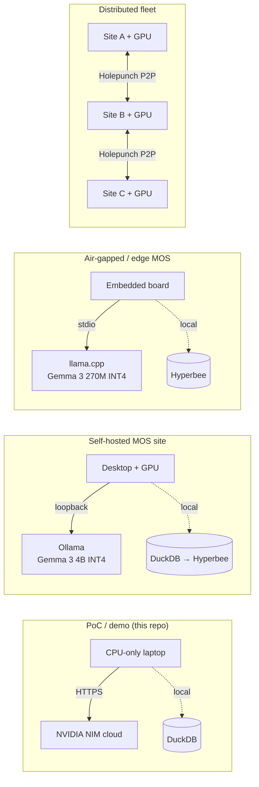

# Deployment Guide

How to run this project from a laptop demo up to an air-gapped MOS site. The code is deployment-agnostic: all external endpoints are env-configurable, and every model is serialised to disk (joblib / ONNX / SB3 zip / torch checkpoint).

---

## Deployment topologies



---

## Hardware tiers

| Tier | Hardware | LLM host | Storage | What runs |
|---|---|---|---|---|
| **A. Demo** | Laptop, 8 GB RAM, no GPU | NVIDIA NIM cloud | DuckDB | Full pipeline end-to-end |
| **B. Self-hosted** | Desktop + 8 GB GPU | Ollama (Gemma 3 4B INT4) | DuckDB &rarr; Hyperbee | Same + local LLM + ONNX GPU inference |
| **C. Air-gapped** | Embedded board (Pi 5 / Jetson) | llama.cpp (Gemma 3 270M INT4) | Hyperbee | KPIs + IF + XGBoost + local LLM |
| **D. Distributed** | GPU node per site | Local per-site Ollama | Hyperbee + Holepunch replication | Federated across MOS sites |

---

## Tier A: Demo (this repo, as-is)

### Prerequisites
- Python 3.11+
- 8 GB RAM (16 GB recommended for LSTM training)
- Optional: free NVIDIA NIM key (`nvapi-...`) at [build.nvidia.com](https://build.nvidia.com) for the AI Assistant

### Steps
```bash
git clone https://github.com/wkatir/planb-tether-mdk-mining-ai.git
cd planb-tether-mdk-mining-ai
pip install -e .
cp .env.example .env
# paste NVIDIA_API_KEY into .env (skip if you do not need the AI Assistant)

python -m app.run_all --fleet-size 50 --days 3
streamlit run app/dashboard/dashboard.py
```

### Expected runtimes on a CPU-only laptop

| Step | Time |
|---|---|
| Generate 50 miners &times; 3 days | ~6 s |
| Ingest + features + KPIs | ~3 s |
| Train Isolation Forest + XGBoost | ~16 s |
| Train LSTM Autoencoder (50 epochs, batch 1) | ~10-30 min |
| AI Assistant response (first call, cold) | ~3-8 s |

**Skip LSTM for the fast demo path** -- `python -m app.run_all --skip-training` then train IF + XGBoost from a REPL in under 20 s.

---

## Tier B: Self-hosted with local GPU

### Switch LLM to Ollama

```bash
# Install Ollama (https://ollama.com)
ollama pull gemma3:4b

# Point the client to Ollama instead of NIM
echo "LLM_BASE_URL=http://localhost:11434/v1" >> .env
echo "LLM_MODEL=gemma3:4b" >> .env
# NVIDIA_API_KEY can be anything non-empty for Ollama
echo "NVIDIA_API_KEY=ollama" >> .env
```

The rest of the app is unchanged. `llm_client.py` is vendor-agnostic.

### GPU-accelerated training

```bash
# PyTorch will auto-detect CUDA; no code change required.
python -c "import torch; print(torch.cuda.is_available())"
# -> True if GPU is visible

# Re-train with GPU:
python -m app.models.train_models
```

### ONNX edge inference (preparing the production path)

```python
from app.models.failure_classifier import FailureClassifier
clf = FailureClassifier.load()
clf.export_onnx()  # writes data/models/classifier.onnx
```

Ship the `.onnx` to an MDK worker and load it with `onnxruntime-node` -- no Python needed at runtime.

---

## Tier C: Air-gapped MOS site

### Prerequisites
- Embedded board with &geq; 4 GB RAM (Raspberry Pi 5, Jetson Nano/Orin, or similar)
- Python 3.11 with a **minimal** profile:

```bash
pip install duckdb pandas pyarrow pydantic pydantic-settings \
            scikit-learn xgboost openai jinja2 streamlit plotly loguru
# intentionally no torch, no stable-baselines3
```

### Minimal mode

Disable the LSTM autoencoder branch (Health Score falls back to `1.0 * IF + 0 * LSTM`). This removes the ~800 MB `torch` dep.

```python
# in your deployment wrapper
from app.models.health_score import HealthScore
hs = HealthScore()
hs.anomaly_detector = None   # IF-only mode; 0.4 weight re-distributed
```

### Local Gemma 3 270M INT4

```bash
# llama.cpp (compile or use prebuilt)
./llama-server -m gemma-3-270m-Q4_K_M.gguf --port 8080

echo "LLM_BASE_URL=http://localhost:8080/v1" >> .env
echo "LLM_MODEL=gemma3-270m" >> .env
```

Measured on a Pixel 9 Pro SoC in Google's own tests: Gemma 3 270M INT4 uses ~0.75 % of battery across 25 conversations (Google Developers Blog, 2025).

---

## Tier D: Distributed across MOS sites

The endgame: multiple mining sites, each running a local stack, with P2P replication through **Holepunch** and **Hyperbee**. When it reaches that stage:

1. **Storage migration.** Replace `app/pipeline/ingestion.py` DuckDB writer with a Hyperbee writer. The row schema already matches Hyperbee's append-only semantics.
2. **HRPC subscription.** Replace Parquet file reads with an HRPC topic subscriber in `app/pipeline/ingestion.py`.
3. **Per-site LLM.** Each site runs its own Ollama container; no shared LLM endpoint.
4. **Cross-site coordination.** Fleet-wide policies (e.g., "never overclock more than 20 % of global fleet at once") propagate over Hyperswarm.

This is the production path but out of scope for the 3-week PoC.

---

## Production checklist (before going live)

- [ ] Secrets in a vault (not `.env` on disk). AWS Secrets Manager, HashiCorp Vault, or the MDK-native key store.
- [ ] Bearer-token auth on the Python service's HTTP surface.
- [ ] SMTP configured (`SMTP_HOST`, etc.) or replace `send_operator_alert` with Postmark / SendGrid.
- [ ] Log shipping to a central sink (Loki, CloudWatch, Datadog).
- [ ] RL agent trained for 1-10 M steps with the real TE/ETE reward, not the simplified placeholder.
- [ ] MiningEnv vectorised across all four ASIC specs (currently one `ASICSpec` per env instance).
- [ ] Hyperbee migration done.
- [ ] HRPC ingestion live.
- [ ] ONNX artefacts deployed to MDK workers with a CI job that re-exports on every model retrain.
- [ ] End-to-end integration tests against a staging MDK instance.

---

## Common commands

```bash
# Reset everything and re-run from scratch
rm -rf data/raw data/processed data/models data/mining.duckdb
python -m app.run_all --fleet-size 50 --days 3

# Run only the AI Assistant smoke test (requires NVIDIA_API_KEY)
python -c "from app.ai.agent import FleetAgent; print(FleetAgent().ask('fleet summary').answer)"

# Dashboard in headless mode (for remote servers)
streamlit run app/dashboard/dashboard.py --server.headless true --server.port 8501

# Run tests without heavy deps (safety core only)
pytest tests/test_{config,safety,decision_engine}.py -v

# Full test suite
pytest tests/ -v
```
